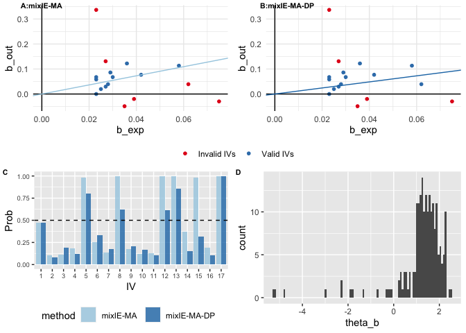

<!-- README.md is generated from README.Rmd. Please edit that file -->
# mixIE

<!-- badges: start -->
<!-- badges: end -->
R package for Mendelian randomization with mixIE methods.

## Installation

<!-- You can install the released version of mixIE from [CRAN](https://CRAN.R-project.org) with:

``` r
install.packages("mixIE")
```

-->
Install the development version from [GitHub](https://github.com/) with:

``` r
# install.packages("devtools")
devtools::install_github("ZhaotongL/mixIE")
```

## Example

Here is an example which shows how to apply mixIE methods to make inference about the causal effect from **Fast Glucose (FG)** to **Type-2 Diabetes (T2D)**

``` r
library(mixIE)
library(ggpubr)
#> Loading required package: ggplot2
#> Loading required package: magrittr
head(FG_T2D)
#>          snp beta_hat_1   seb1  beta_hat_2       seb2 A1 A2  p_value   trait1
#> 1 rs10276674     -0.036 0.0051 -0.12221763 0.02457733  A  G 1.75e-12 magic_fg
#> 2 rs10787312      0.042 0.0062  0.07696104 0.03063560  A  G 1.15e-11 magic_fg
#> 3 rs10830961     -0.058 0.0038 -0.11332868 0.01935931  A  G 1.73e-52 magic_fg
#> 4 rs11039182      0.025 0.0041  0.01980263 0.02208948  A  G 3.36e-09 magic_fg
#> 5 rs11558471      0.027 0.0040  0.13102826 0.02136935  A  G 2.62e-11 magic_fg
#> 6 rs11717195      0.029 0.0047  0.08617770 0.01948067  A  G 1.11e-09 magic_fg
#>        trait2
#> 1 diagram_t2d
#> 2 diagram_t2d
#> 3 diagram_t2d
#> 4 diagram_t2d
#> 5 diagram_t2d
#> 6 diagram_t2d
```

Now we perform mixIE-MA with the outcome sample size 69033 and reorientating IVs with all positive associations with the exposure.

``` r
set.seed(1)
mixIE_MA_result = mixIE_MA(b_exp=FG_T2D$beta_hat_1,b_out=FG_T2D$beta_hat_2,
                           se_exp=FG_T2D$seb1,se_out = FG_T2D$seb2,
                           n=69033,flip=1)
mixIE_MA_result
#> $theta_BIC_MA
#> [1] 1.822721
#> 
#> $se_BIC_MA
#> [1] 0.3510853
#> 
#> $pval_BIC_MA
#> [1] 2.084115e-07
#> 
#> $r_BIC_MA
#> [1] 0.008778518
#> 
#> $p_BIC_MA
#> [1] 0.3529412
#> 
#> $c_BIC_MA
#> [1] 52.49185
#> 
#> $tau_BIC_MA
#>  [1] 0.4748243 0.1084977 0.1093451 0.1866772 0.9852829 0.2496352 0.1339386
#>  [8] 0.9982896 0.1715386 0.1197852 0.1251052 0.9990435 1.0000000 0.3696358
#> [15] 0.9808303 0.1899306 1.0000000
#> 
#> $theta_vec
#> [1]  1.872933  1.995895 -1.493302  1.430731
```

We can also obtain the results for mixIE-MA when directly implementing mixIE-MA-DP:

``` r
set.seed(1)
mixIE_MA_DP_result = mixIE_MA_DP(b_exp=FG_T2D$beta_hat_1,b_out=FG_T2D$beta_hat_2,
                           se_exp=FG_T2D$seb1,se_out = FG_T2D$seb2,
                           n=69033,flip=1)
mixIE_MA_DP_result
#> $mixIE_MA_theta
#> [1] 1.822721
#> 
#> $mixIE_MA_se
#> [1] 0.3510853
#> 
#> $mixIE_MA_pval
#> [1] 2.084115e-07
#> 
#> $mixIE_MA_pi
#> [1] 0.3529412
#> 
#> $mixIE_MA_tau
#>  [1] 0.4748243 0.1084977 0.1093451 0.1866772 0.9852829 0.2496352 0.1339386
#>  [8] 0.9982896 0.1715386 0.1197852 0.1251052 0.9990435 1.0000000 0.3696358
#> [15] 0.9808303 0.1899306 1.0000000
#> 
#> $mixIE_MA_DP_theta
#> [1] 1.212951
#> 
#> $mixIE_MA_DP_se
#> [1] 1.128546
#> 
#> $mixIE_MA_DP_pval
#> [1] 0.2824681
#> 
#> $mixIE_MA_DP_pi
#> [1] 0.2941176
#> 
#> $mixIE_MA_DP_tau
#>  [1] 0.470 0.085 0.190 0.120 0.800 0.335 0.175 0.625 0.210 0.170 0.105 0.615
#> [13] 0.860 0.150 0.320 0.105 1.000
```

We can obtain the diagnostic plots of mixIE-MA-DP by setting `diagnostic_plot=TRUE`:

``` r
set.seed(1)
mixIE_MA_DP_result = mixIE_MA_DP(b_exp=FG_T2D$beta_hat_1,b_out=FG_T2D$beta_hat_2,
                           se_exp=FG_T2D$seb1,se_out = FG_T2D$seb2,
                           n=69033,flip=1,point_size = 2,
                           diagnostic_plot = TRUE) 
g1=ggarrange(mixIE_MA_DP_result$scatter_og.plot, mixIE_MA_DP_result$scatter_dp.plot,labels =c("A:mixIE-MA", "B:mixIE-MA-DP"),
            common.legend=TRUE,legend = 'bottom',font.label = list(size = 8))
g2=ggarrange(mixIE_MA_DP_result$iv_barplot, mixIE_MA_DP_result$est_hist,labels =c("C", "D"),
               legend = 'bottom',font.label = list(size = 8))
ggarrange(g1,g2,nrow = 2)
```


